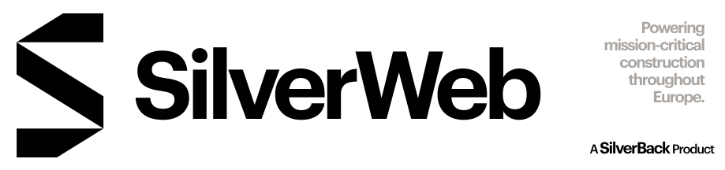

# SilverWeb

is a SaaS. It is build with the personalized Stack **SilverStack**. SilverWeb includes a suite collection with landing page.

## ✍🏻 Authors

- [@dontfred](https://www.github.com/dontfred)

## ❇️ SilverStack

**Tooling:** 🥟 Bun

**Monorepo:** 🔄 Turborepo

**Client:** ➡️ NextJS

**UI:** ☸️ Storybook, ❇️ Vite, ⚛️ React, 🌊 Tailwind

**Testing:** ☸️ Storybook

**Server:** ➡️ NextJS, ✳️ NodeJS

**Backend:** ⏃ Prisma, 🗳️ tRPC, 🔐 WebAuthN, 🐘 PostgreSQL, 🔑 Redis

## Used By

This project is used by the following companies:

- SilverBack Staffing Ltd
- SilverBack Polska Sp. z o.o.
- SilverBack Danmark ApS
- SilverBack Instal SR

## Support

For support, email fgrimm@silverback.ie.

## 🔐 AGPL

Copyright ([©](https://www.ipoi.gov.ie/en/types-of-ip/copyright1/understanding-copyright/the-copyright-notice-and-symbol-%C2%A9/)) 2023 - present Frederik W. Grimm for SilverBack Staffing Ltd.

This source code is licensed under the AGPL license found in the LICENSE file in the root directory of this source tree.
